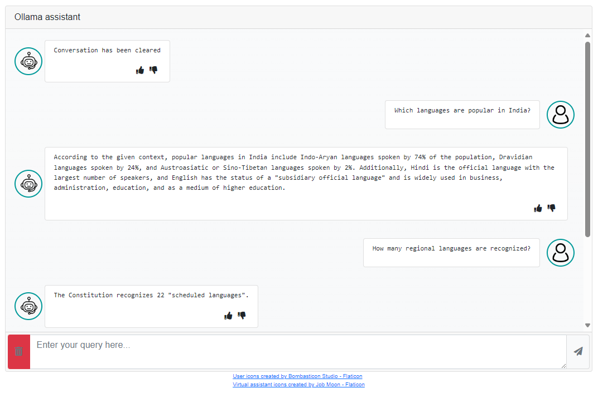

<b>LLM chat implementation</b>

A chat web component interface made using vanilla js, bootstrap and font-awesome css.
The repo also contains an example usage with ollama.

Steps to execute
 - Install ollama from https://ollama.com/
 - Pull llama3 model with `ollama pull llama3`
 - Install chromadb from https://www.trychroma.com/
 - Place .txt, .docx and .pdf contents in docs/ folder
 - On root folder of this repo, run
 - `npm install`
 - `npm start`
 -  Launch http://localhost:3000

Now, all questions asked will be replied based on the contents in the docs folder. 
If no context is available from file contents, the model weights will be used.

Reference used : https://github.com/vteam27/RagXOllama

Flaticons have been used in this project  
<a href="https://www.flaticon.com/free-icons/user" title="user icons">User icons created by Freepik - Flaticon</a>  
<a href="https://www.flaticon.com/free-icons/virtual-assistant" title="virtual assistant icons">Virtual assistant
        icons created by Job Moon - Flaticon</a>
